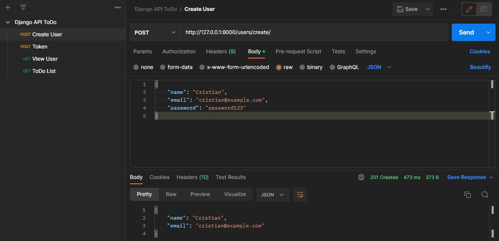
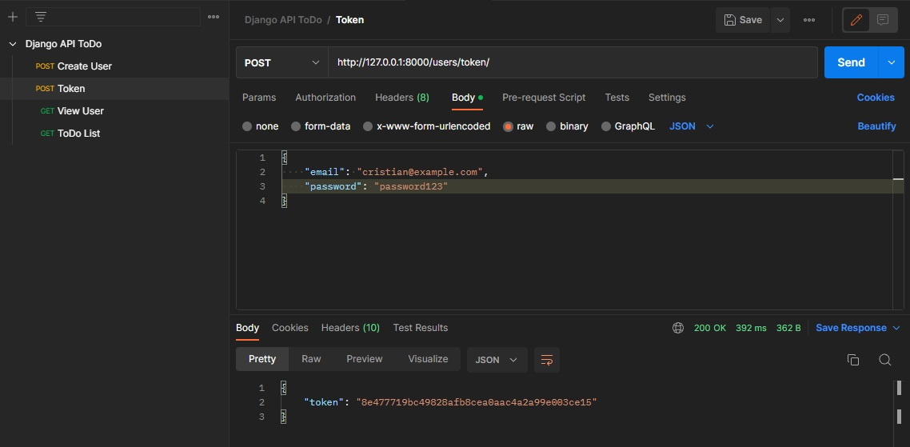
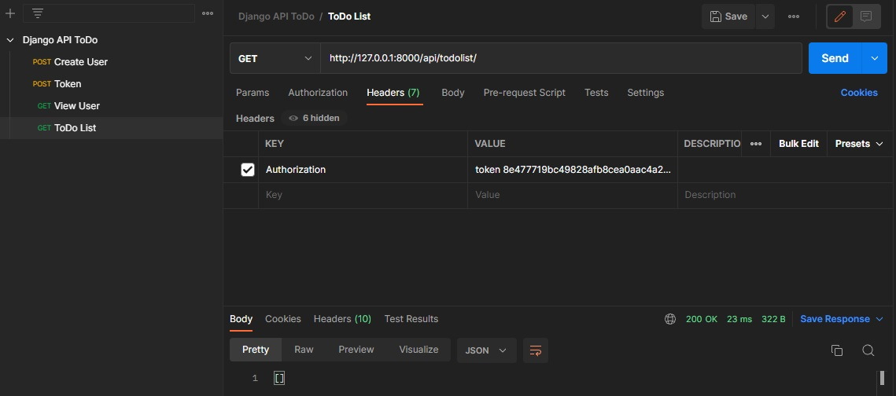
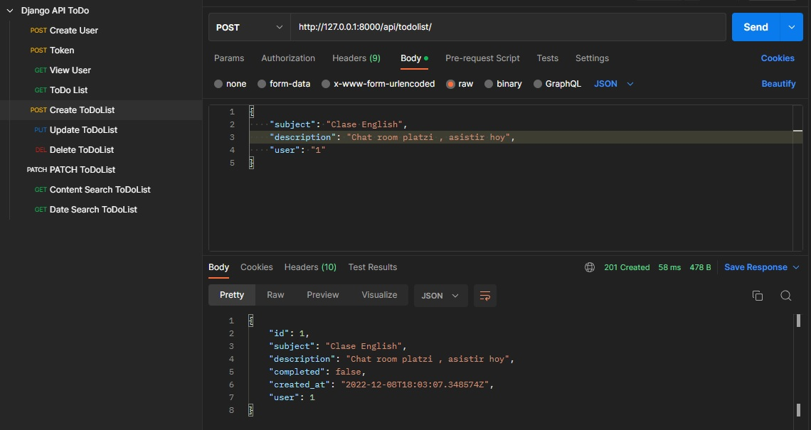
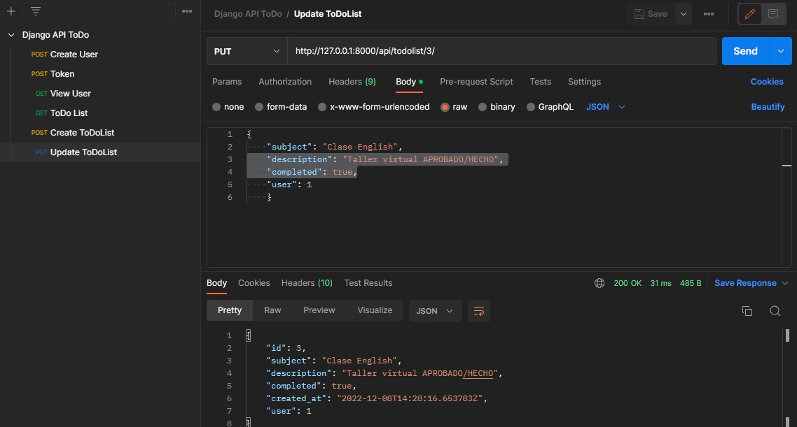
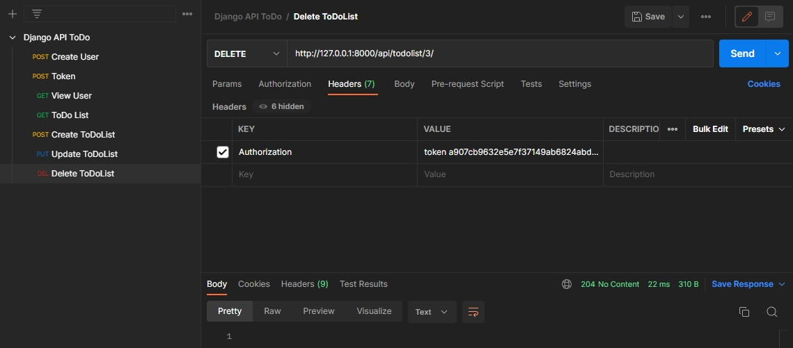
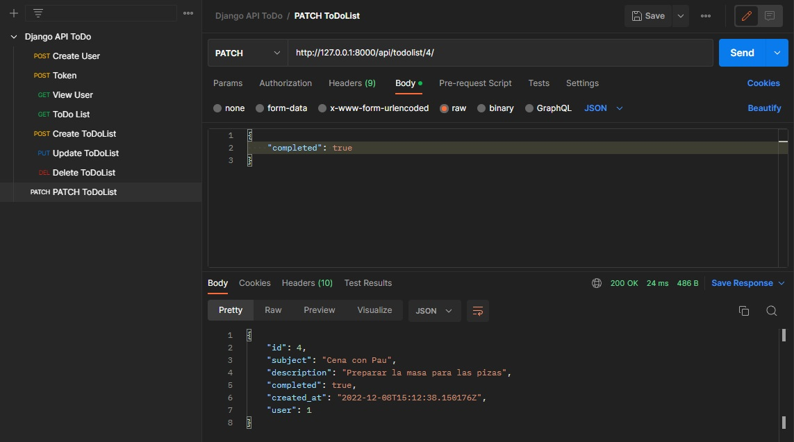
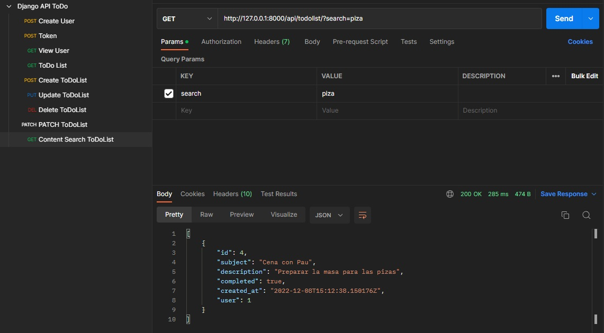
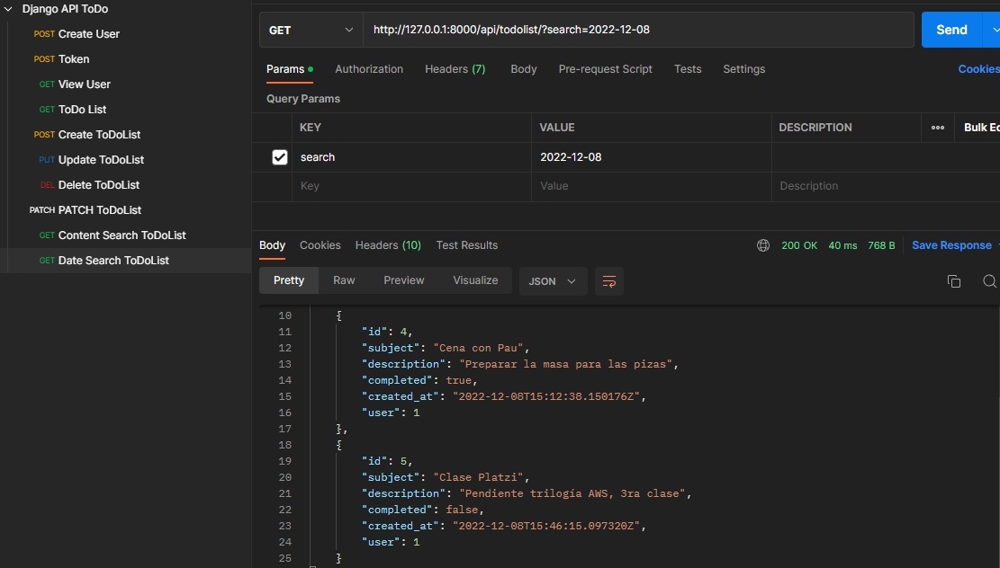

# Invera ToDo-List Challenge (Python/Django Jr-SSr)
## Requisitos:

- Docker y docker-compose instalado.
- Postman o alguna otra herramienta para testear APIs.
- ...

## Pasos:

- Ejecutar "docker compose up" en la terminal de linea de comandos 
- Se puede crear un superusuario, aunque no es necesario
- Crear un usuario 
- Obtener un token
- Se puede crear tareas, listarlas , editarlas, eliminar, actualizar
- Así como filtrar y buscar

A continuación se muestra los ejemplos mediante captura de pantalla de todos los puntos enumerados anteriormente

## En Postman:

- Se crea un usuario enviando un JSON con name, email y password como se puede observar en la siguiente imagen:

- Un token de autenticación se obtiene con un JSON con email y password:

- Ingresando este token en el header ya se puede realizar una consulta a la lista de tareas; en este caso nos dará como resultado una lista vacia:

- Y así se puede crear, eliminar, actualizar(marcar tarea como completada por ejemplo con PATCH), filtrar y buscar por fecha de creación y por el el contenido. Tal como se puede observar en las capturas de pantalla a continuación:

